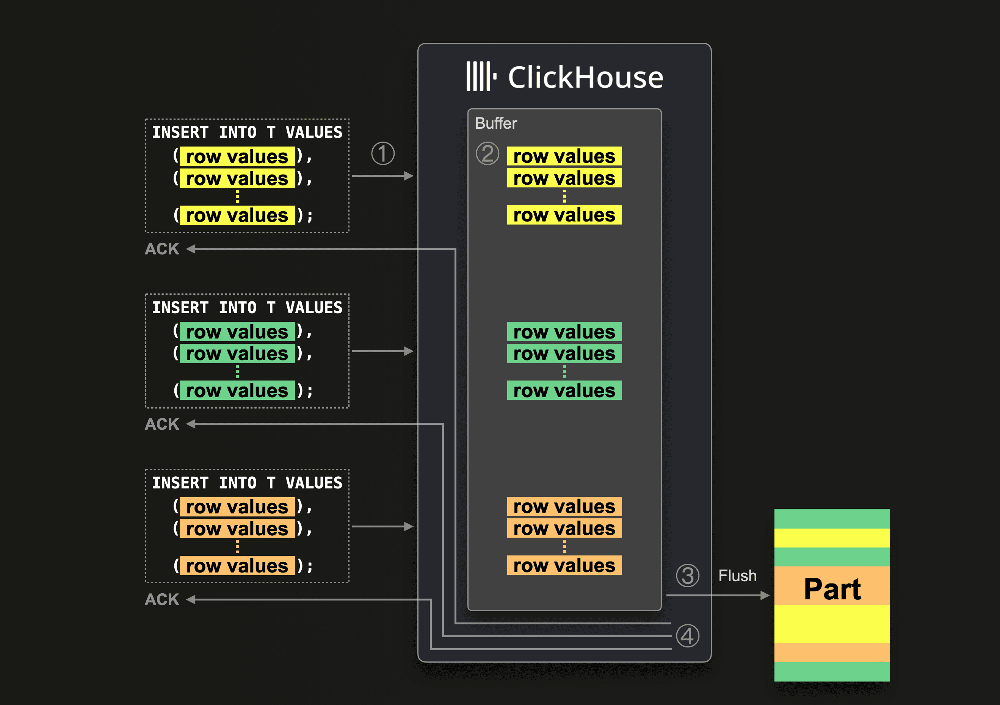
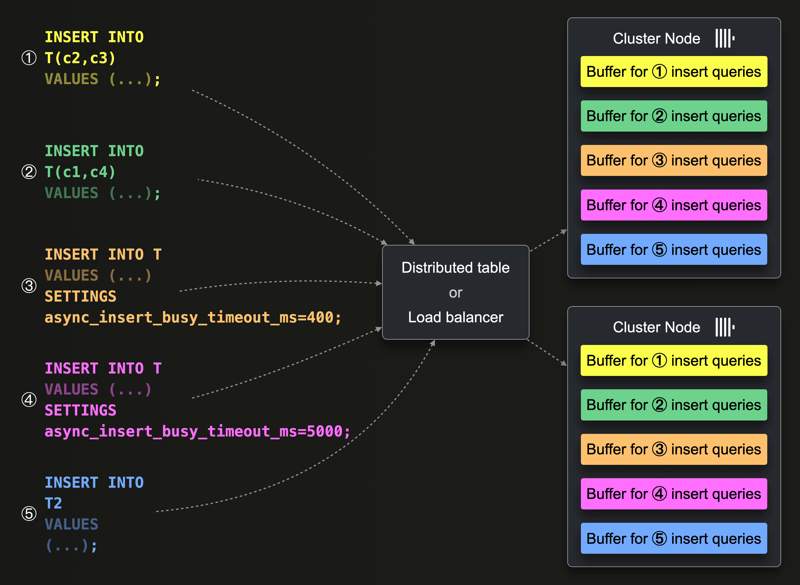

There seem to be two main ways to deal with writing many things to clickhouse: client-side batching/throttling, and async.

# sources

https://clickhouse.com/docs/en/cloud/bestpractices/bulk-inserts

https://clickhouse.com/docs/en/cloud/bestpractices/asynchronous-inserts
    -> https://github.com/ClickHouse/clickhouse-java/issues/820
        -> https://github.com/CurtizJ/ClickHouse/blob/f6191b98e74af57ae4ace34c21b269fedcf8ecbd/tests/queries/0_stateless/02015_async_inserts_4.sh#L7
        -> https://github.com/ClickHouse/clickhouse-java/blob/c69c8a8c5a4c273beb3b61b940009072d7a4d85f/clickhouse-jdbc/src/test/java/com/clickhouse/jdbc/ClickHouseStatementTest.java#L124-L155

# snippets

writing a file to clickhouse: https://gist.github.com/den-crane/fd8e0c187fc6f7ee6037d254fb99667b

easy enough to change to tsv format (instead of parquet)

# configurable bits

* default it to 'wait'

for async, it will cut the batches based on either a timeout, or a size
    https://clickhouse.com/docs/en/cloud/bestpractices/asynchronous-inserts
    

for any write, there is background activity to merge parts
    https://clickhouse.com/blog/asynchronous-data-inserts-in-clickhouse
    https://clickhouse.com/docs/en/operations/server-configuration-parameters/settings#background_pool_size
    https://clickhouse.com/docs/en/operations/settings/merge-tree-settings#parts-to-throw-insert

    example deployment details:
        "We are using a ClickHouse Cloud service with a service size of 24 GiB of main memory and 6 CPU cores for benchmarks.
        This service consists of 3 compute nodes with 8 GiB of main memory and 2 CPU cores."

"Before the buffer gets flushed, the data of other asynchronous insert queries from the same or other clients can be collected in the buffer."
    -> the async buffer is shared amongst all clients/queries...

* to combat timeouts... could perhaps do a combination of async and client batching
    ex: doing client batches of 100K, using an async write...
        ! this doesn't look like it woudl make sense - since the ack only comes back after everything is flushed (would only make sense w/o wait)

"Therefore the sketched 3 inserts in the diagram above can't stem from the same single-threaded insert loop but from different multi-threaded parallel insert loops or different parallel clients/programs."

...so could use separate threads for the 'batches'...
    yeah, they say the same thing:
    "In such scenarios, ingest throughput can be increased by appropriately batching the data client-side and using multi-threaded parallel insert loops."

example settings for their benchmark:
"
① async_insert = 1
② wait_for_async_insert = 1
③ async_insert_busy_timeout_ms = 1000
④ async_insert_max_data_size = 1_000_000
⑤ async_insert_max_query_number = 450

②, ③, ④, ⑤ are the default values in ClickHouse (③ has 200 as default value in OSS and 1000 in ClickHouse Cloud)
"
? can a client configure these?

* it might be helpful to ensure that the data is sorted beforehand....
...maybe increase the busy_timeout so that it only flushes once it get everything?  (but still stays w/i timeout?)
...for a similar reason, maybe increase max_data_size? or make my batches roughly that size?
    => yeah, their other benchmarks seem to suggest this:

"
① async_insert = 1
② wait_for_async_insert = 0
③ async_insert_busy_timeout_ms = 5000 (Benchmark 1)
   async_insert_busy_timeout_ms = 30_000 (Benchmark 2)
④ async_insert_max_data_size = 100_000_000
⑤ async_insert_max_query_number = 450_000
"

* though the 'no wait' option is appealing (b/c fast), it has essentially no durability or error-visibility guarantees, so will not be considering it for this usecase...

"There will be one buffer per insert query shape (the syntax of the insert query excluding the values clause / the data) and settings. And on a multi-node cluster (like ClickHouse Cloud), the buffers will exist per node."

"For tables of the merge tree engine family, ClickHouse will, by default, automatically deduplicate asynchronous inserts. That makes asynchronous inserts idempotent and, therefore failure tolerant in cases like the following...
However, in both cases, the unacknowledged insert can just immediately be retried. As long as the retried insert query contains the same data in the same order, ClickHouse will automatically ignore the retried asynchronous insert if the (unacknowledged) original insert succeeded."

"the data from an asynchronous insert query is only parsed and validated against the target table's schema when the buffer gets flushed. If some row values from an insert query can’t be inserted because of parsing or type errors, then none of the data from that query is flushed (the flushing of data from other queries is unaffected by this)."

...buffer tables are similar-to but different-from async writes
    - additional setup required (on each node)
    - different sql (instead of just query setting)
"Asynchronous inserts can be considered as a successor to buffer tables."

# bigger setups - architecture

https://clickhouse.com/blog/storing-log-data-in-clickhouse-fluent-bit-vector-open-telemetry#architectures
    ...the dangers of using the k8 agent/operator...

https://vector.dev/docs/setup/going-to-prod/

# side-bar : collections

using maps (ex: to avoid column expansion): https://clickhouse.com/docs/en/integrations/data-formats/json#using-maps 

# side-bar: columns and keys

"In most cases, order your columns in order of increasing cardinality"
"Beyond 3-4, columns within a key are typically not recommended and provide little value."

https://clickhouse.com/docs/en/optimize/sparse-primary-indexes#generic-exclusion-search-algorithm

