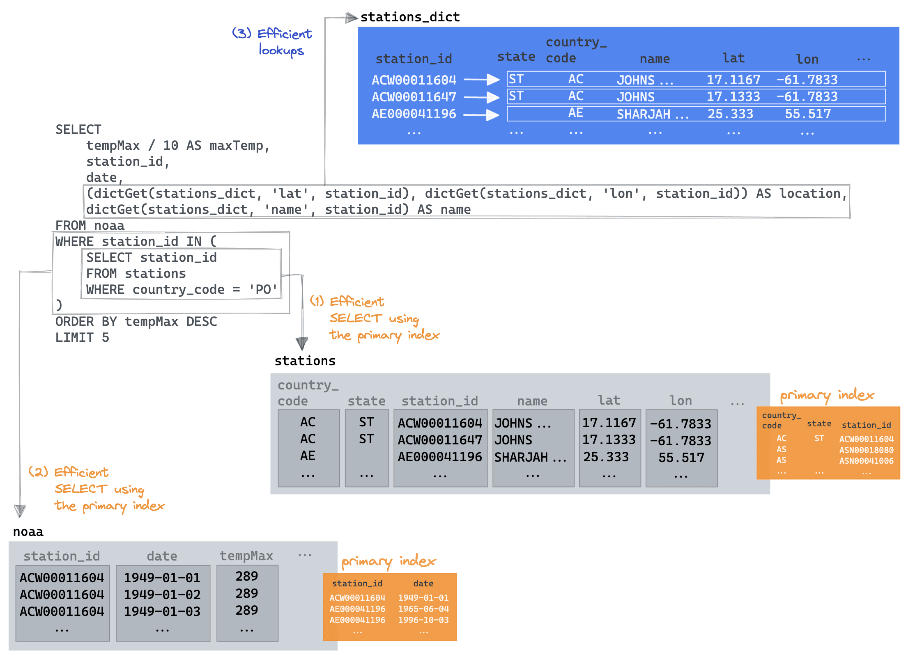

## which dictionary type?
> https://clickhouse.com/blog/faster-queries-dictionaries-clickhouse

* apparently these are especially good for joins... (atleast when they can fit into memory...)

> *Our above dictionary DDL also highlights the need to specify a `LIFETIME` for our dictionary. This specifies how often the dictionary should be refreshed by re-reading the source.*
> ...
> *The value `LIFETIME(MIN 0 MAX 0)`, used in our example, means the dictionary contents will never be updated - appropriate in our case as our data is static.*

! use "*SYSTEM RELOAD DICTIONARY*" to trigger a load. (otherwise it will be done on read...)

>*An experienced dictionary user might be tempted to try other approaches here. We could, for example:

- Drop the sub-query and utilise a `dictGet(stations_dict, 'country_code', station_id) = 'PO'` filter. This [isn't faster](https://play.clickhouse.com/play?user=play#ClNFTEVDVAogICAgdGVtcE1heCAvIDEwIEFTIG1heFRlbXAsCiAgICBzdGF0aW9uX2lkLAogICAgZGF0ZSwKICAgIChkaWN0R2V0KGJsb2dzLnN0YXRpb25zX2RpY3QsICdsYXQnLCBzdGF0aW9uX2lkKSwgZGljdEdldChibG9ncy5zdGF0aW9uc19kaWN0LCAnbG9uJywgc3RhdGlvbl9pZCkpIEFTIGxvY2F0aW9uLAogICAgZGljdEdldChibG9ncy5zdGF0aW9uc19kaWN0LCAnbmFtZScsIHN0YXRpb25faWQpIEFTIG5hbWUKRlJPTSBibG9ncy5ub2FhCldIRVJFIGRpY3RHZXQoYmxvZ3Muc3RhdGlvbnNfZGljdCwgJ2NvdW50cnlfY29kZScsIHN0YXRpb25faWQpID0gJ1BPJwpPUkRFUiBCWSB0ZW1wTWF4IERFU0MKTElNSVQgNQ==) (around 0.5s) as a dictionary look-up needs to be made for each station. We look at a similar example to this below.
- Exploit the fact that dictionaries can be used in JOIN clauses like tables (see below). This suffers from the same challenge as the previous proposal, delivering [comparable performance](https://play.clickhouse.com/play?user=play#U0VMRUNUCiAgICB0ZW1wTWF4IC8gMTAgQVMgbWF4VGVtcCwKICAgIHN0YXRpb25faWQsCiAgICBkYXRlLAogICAgc3RhdGlvbnNfZGljdC5uYW1lIEFTIG5hbWUsCiAgICAoYmxvZ3Muc3RhdGlvbnNfZGljdC5sYXQsIGJsb2dzLnN0YXRpb25zX2RpY3QubG9uKSBBUyBsb2NhdGlvbgpGUk9NIGJsb2dzLm5vYWEKSU5ORVIgSk9JTiBibG9ncy5zdGF0aW9uc19kaWN0IE9OIGJsb2dzLm5vYWEuc3RhdGlvbl9pZCA9IHN0YXRpb25zX2RpY3Quc3RhdGlvbl9pZApXSEVSRSBkaWN0R2V0KGJsb2dzLnN0YXRpb25zX2RpY3QsICdjb3VudHJ5X2NvZGUnLCBzdGF0aW9uX2lkKSA9ICdQTycKT1JERVIgQlkgdGVtcE1heCBERVNDCkxJTUlUIDUK).*

! 'CTE' = "Common Table Expression"

! apparently we can join on a dictionary on something that isn't even a key (which then acts like a table scan...)
	"*Note how we still join on the `state` column even though it is not a primary key in our `resorts` dictionary. In this case, we use the JOIN syntax, and the dictionary will be scanned like a table.*"

> *"The advice here is thus to test! If [dictGet](https://clickhouse.com/docs/en/sql-reference/functions/ext-dict-functions/#dictget-dictgetordefault-dictgetornull) is required for a large percentage of the rows in a table, e.g., in a condition, you may be better off just utilizing the native data structures and indexes of ClickHouse."*

> "*The dictionary layouts we have described reside entirely in memory. Be mindful of their usage and test any layout changes. You can track their memory overhead using the [system.dictionaries](https://clickhouse.com/docs/en/operations/system-tables/dictionaries) table and `bytes_allocated` column.*"
