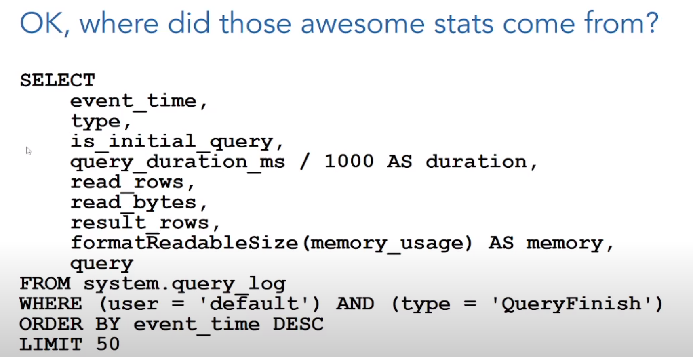
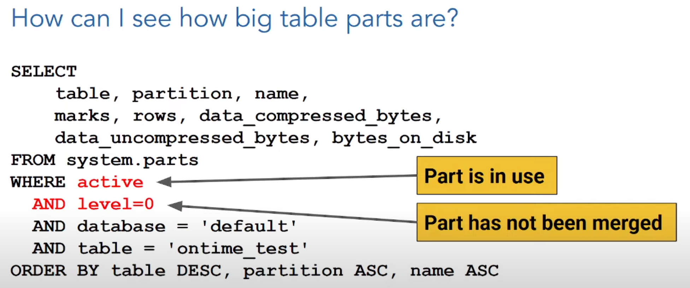
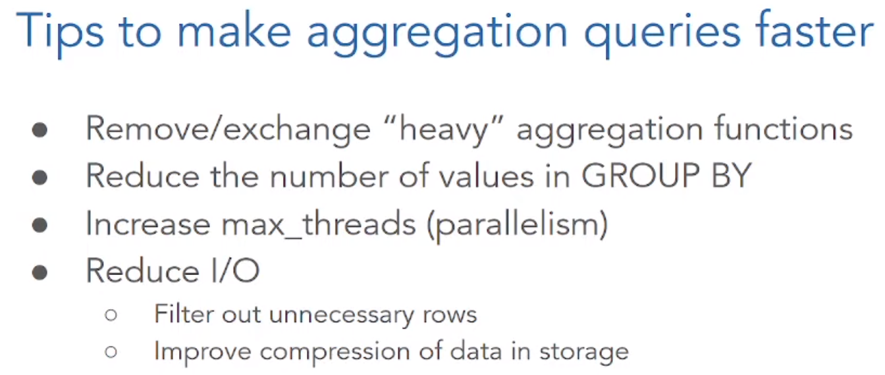
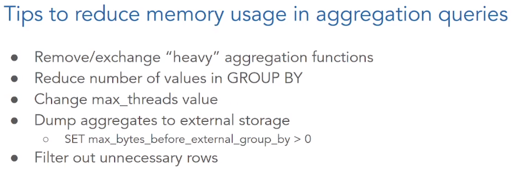
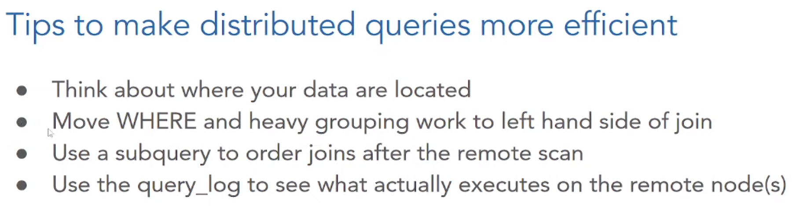
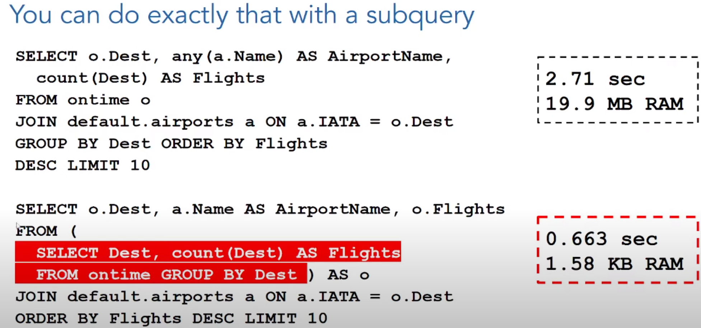
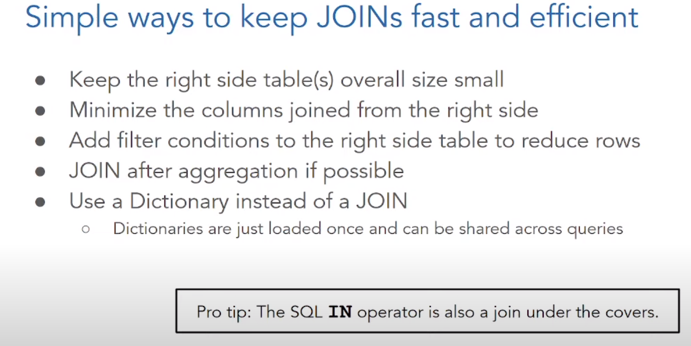

https://www.youtube.com/watch?v=XpkFEj1rVXg
  https://altinity.com/presentations/a-day-in-the-life-of-a-clickhouse-query-2

* intro included an assumption about who the audience is, and what they want (neat technique)

* columnar, open-source
* distributed
* execution engine (parallel & vectorized)
* compared to a hash-table
* implied that they are running on SSDs
* before changing ingest params, evaluate logs...
* queries typically focus on aggregation
	* scan then merge
		* scan is like the gather/map..
	* compared to map-reduce
* scans are multi-threaded by default
	* 1/2 of cpus
* no caching layer for queries (aside from page-cache)
	* focus instead is on working in memory
		* ex: reducing/merging is attempted in memory...
	* more complex aggregations can have a huge memory impact

## more!

https://altinity.com/presentations/
https://altinity.com/blog/
https://kb.altinity.com/
https://clickhouse.com/docs/en/intro

## configs
* _max_insert_threads_
	* correlates to higher memory usage
		* this isn't necessarily the same for query though
	* ...unclear how much parallelization is possible... 
* _max_memory_usage_
	* per query
	* default: 10GB
* _max_memory_usage_for_user_
	* default: unlimited
* _max_server_memory_usage_
	* default: 90%
* _input_format_parallel_parsing_
	* off by default
## table :
* engines - standard is 'merge tree'
	* https://kb.altinity.com/engines/
	* use 'distributed' engine to ensure that requests are load balanced
		* it delegates to the actual engine...
		* use 'sharding key' to shard (also done by distributed engine)
	* need 'ReplicatedMergeTree' for distribution
		* can upgrade/downgrade btw the two
		* distribution done w/ Zookeeper
	* will re-write/merge parts to improve compression
		* updates/deletes also trigger re-writes
			* so want to write larger chunks (instead of many small writes)
* partition keys
	* want: big partitions
		* 1-300GB
		* < 1K partitions per table
			* if more, can spread them across nodes...
* ordering (can be multi-key)
	* by default this is the primary key
* columns are sorted
	* this affects indicies
* indicies (implicitly)
	* sparse: not all entries (one entry for each 'granule')
		* default is one entry per 8K rows
		* tries to fit these into memory
	* makes writes more complex (read optimized)
* can be loaded from another table
* stats:
	* system.query_log
		* needs to be enabled (config.xml)
	* system.parts

### metrics and queries

## distributed queries

* sharding different from partitioning
	* shards can be replicated
* querying this is compared to querying a view...
* any node can be the 'initiator' node (which starts queries, and receives results from other nodes)
* as with joins, you want to filter as much as possible locally (by doing sub-queries for examples)

## joins
* hash join
	* load small/right into memory as hashtable
		* lots of columns/values can exhaust memory
	* do things as a subquery so that more filtering/merging can be done before the join

> *When running a JOIN, there is no optimization of the order of execution in relation to other stages of the query. The join (a search in the right table) is run before filtering in WHERE and before aggregation.”*
> https://clickhouse.com/blog/faster-queries-dictionaries-clickhouse
> https://clickhouse.com/docs/en/sql-reference/statements/select/join

### comparing joins

