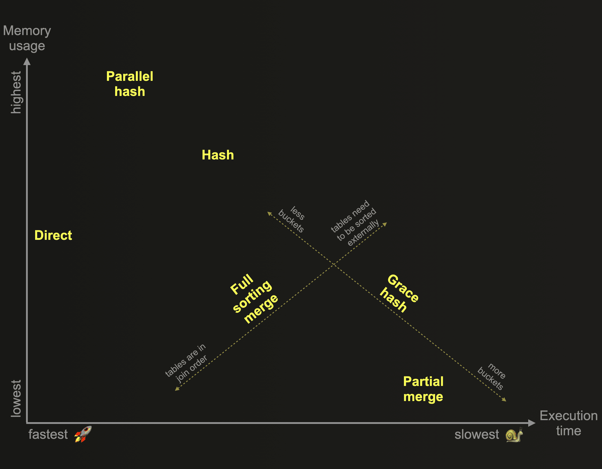
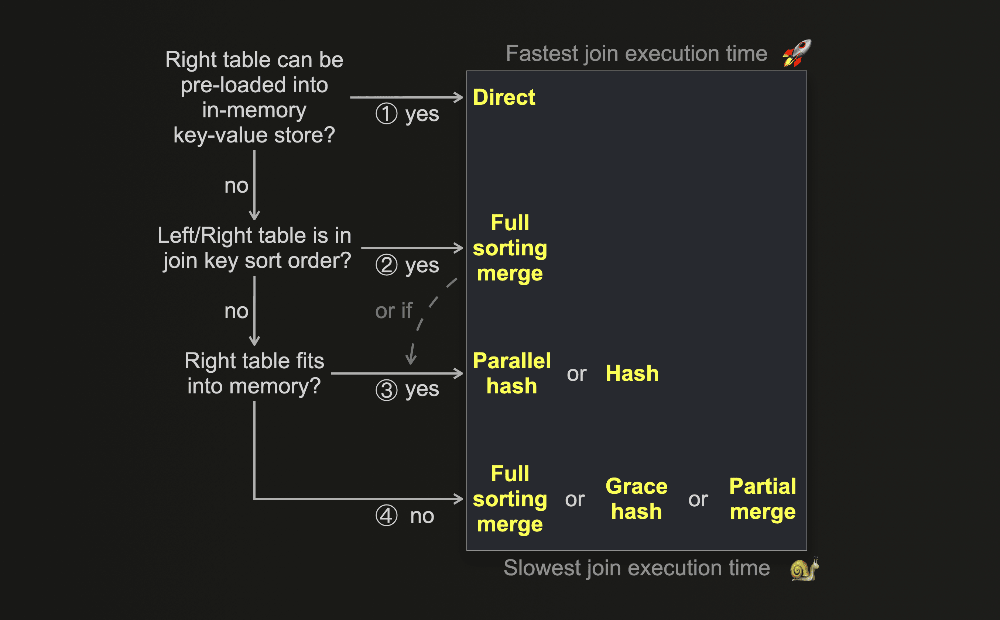
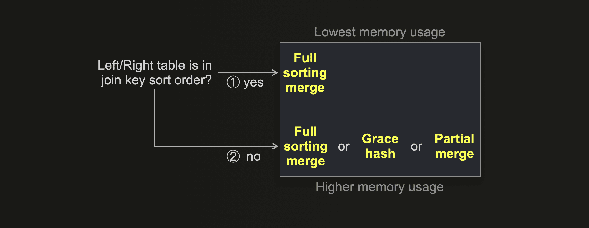

# different join types
* https://clickhouse.com/blog/clickhouse-fully-supports-joins-part1

## inner (default)
```
SELECT m.name AS name, g.genre AS genre 
FROM movies AS m 
INNER JOIN genres 
AS g ON m.id = g.movie_id 
ORDER BY m.year DESC, m.name ASC, g.genre ASC 
LIMIT 10; 

10 rows in set. Elapsed: 0.126 sec. Processed 783.39 thousand rows, 21.50 MB (6.24 million rows/s., 171.26 MB/s.)
```

## cross ('either')

> *The CROSS JOIN produces the full cartesian product of the two tables without considering join keys.*

```
  
SELECT m.name AS name, g.genre AS genre 
FROM movies AS m 
CROSS JOIN genres AS g 
WHERE m.id = g.movie_id 
ORDER BY m.year DESC, m.name ASC, g.genre ASC
LIMIT 10;

10 rows in set. Elapsed: 0.150 sec. Processed 783.39 thousand rows, 21.50 MB (5.23 million rows/s., 143.55 MB/s.)
```

## anti-join
> *An alternative formulation of our previous outer join example query is using an anti join for finding movies that have no genre in the dataset:*

```
SELECT m.name FROM movies AS m 
LEFT ANTI JOIN genres AS g ON m.id = g.movie_id
ORDER BY year DESC, name ASC LIMIT 10;
```


# different join algorithms

* https://clickhouse.com/blog/clickhouse-fully-supports-joins-how-to-choose-the-right-algorithm-part5

> "*The following 6 join algorithms have been developed for ClickHouse so far:
> - [Direct join](https://clickhouse.com/blog/clickhouse-fully-supports-joins-direct-join-part4#direct-join)
> - [Hash join](https://clickhouse.com/blog/clickhouse-fully-supports-joins-part2#hash-join)
> - [Parallel hash join](https://clickhouse.com/blog/clickhouse-fully-supports-joins-part2#parallel-hash-join)
> - [Grace hash join](https://clickhouse.com/blog/clickhouse-fully-supports-joins-hash-joins-part2#grace-hash-join)
> - [Full sorting merge join](https://clickhouse.com/blog/clickhouse-fully-supports-joins-part3#full-sorting-merge-join)
> - [Partial merge join](https://clickhouse.com/blog/clickhouse-fully-supports-joins-part3#partial-merge-join)*"

> "*When [join_algorithm](https://clickhouse.com/docs/en/operations/settings/settings#settings-join_algorithm) is set to `auto`, ClickHouse tries the hash join algorithm first, and if that algorithm’s [memory limit](https://clickhouse.com/docs/en/operations/settings/query-complexity#settings-max_bytes_in_join) is violated, the algorithm is switched on the fly to partial merge join. You can observe which algorithm was chosen via [trace logging](https://clickhouse.com/docs/knowledgebase/send_logs_level).*"




* pre-sorting data can improve joins (allowing more performant ones to be utilized)

> "*- The [Grace hash join](https://clickhouse.com/blog/clickhouse-fully-supports-joins-hash-joins-part2#grace-hash-join) is a non-memory bound version that spills data temporarily to disk without requiring any sorting of the data. This overcomes some of the performance challenges of other non-memory bound ClickHouse join algorithms, that spill data temporarily to disk but require prior sorting of the data.*"
> ...
> "*ClickHouse offers two additional non-memory bound join algorithms based on [external sorting](https://en.wikipedia.org/wiki/External_sorting): 
> 
> - The [Full sorting merge join](https://clickhouse.com/blog/clickhouse-fully-supports-joins-part3#full-sorting-merge-join) is based on in-memory or external sorting and can take advantage of the [physical row order](https://clickhouse.com/docs/en/optimize/sparse-primary-indexes#data-is-stored-on-disk-ordered-by-primary-key-columns) of the joined tables and [skip](https://clickhouse.com/blog/clickhouse-fully-supports-joins-full-sort-partial-merge-part3#utilizing-physical-row-order) the sorting phase. In such cases, the join performance can be competitive with some of the hash join algorithms from the chart above while generally requiring significantly less main memory.
> - The [Partial merge join](https://clickhouse.com/blog/clickhouse-fully-supports-joins-part3#partial-merge-join) is optimized for minimizing memory usage when large tables are joined and always fully sorts the right table first via external sorting. The left table is also always sorted, [block-wise](https://clickhouse.com/docs/en/operations/settings/settings#setting-max_block_size) in-memory. The join matching process runs more efficiently if the physical row order of the left table matches the join key sorting order.
> *"



>"*If the data from the right-hand side table can be pre-loaded into an in-memory low-latency key-value data structure, e.g., a [dictionary](https://clickhouse.com/docs/en/sql-reference/dictionaries), and if the join key matches the key attribute of the underlying key-value storage, and if [LEFT ANY JOIN](https://clickhouse.com/blog/clickhouse-fully-supports-joins-part1#left--right--inner-any-join) semantics is adequate - then the **direct join** is applicable and offers the fastest approach.*


