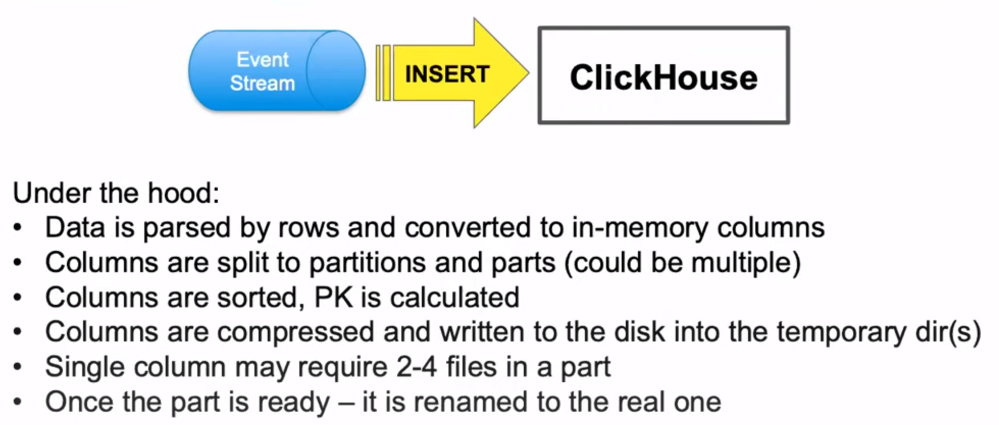

https://altinity.com/presentations/high-performance-high-reliability-data-loading-on-clickhouse-2
https://youtu.be/rexGRyl8yuA

wal (if they have one) is not synced as part of ingestion being 'completed' (so a crash can cause loss of data, rather than just reconstruction)
	...yeah, they introduced a wal in 20.6

things may come in by rows, but are split into (and stored as) columns...

can use 'buffer tables' to collect stuff into memory, then write with a single flush/sync after a certain threshold (time/size)

"polymorphic merge tree" - to handle many small inserts...

materialized views upon the target insert table can also complicate things (they may not be consistent...)